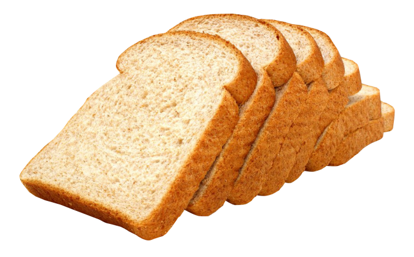
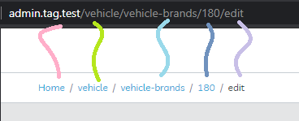

[![Contributors][contributors-shield]][contributors-url]
[![Forks][forks-shield]][forks-url]
[![Stargazers][stars-shield]][stars-url]
[![Issues][issues-shield]][issues-url]
[![MIT License][license-shield]][license-url]
[![LinkedIn][linkedin-shield]][linkedin-url]

<!-- PROJECT LOGO -->
<br />
<p align="center">
  <a href="https://github.com/amans199/the-simplest-breadcrumb">
    
  </a>

  <h3 align="center">The simplest Breadcrumb you will ever use</h3>

  <p align="center">
    Your website is just a one line away from having an awesome breadcrumb that actually WORKS
    <br />
    <a href="https://github.com/amans199/the-simplest-breadcrumb"><strong>Explore the docs »</strong></a>
    <br />
    <br />
    <a href="https://github.com/amans199/the-simplest-breadcrumb">View Demo</a>
    ·
    <a href="https://github.com/amans199/the-simplest-breadcrumb/issues">Report Bug</a>
    ·
    <a href="https://github.com/amans199/the-simplest-breadcrumb/issues">Request Feature</a>
  </p>
</p>


<!-- TABLE OF CONTENTS -->
## Table of Contents
* [Installation](#installation)
* [Usage](#usage)
* [Contributing](#contributing)
* [License](#license)
* [Contact](#contact)

### Installation

```sh
npm install the-simplest-breadcrumb --save
```
```sh
import TheSimplestBreadcrumb from 'the-simplest-breadcrumb'
```

<!-- USAGE EXAMPLES -->
## Usage
  <a href="https://github.com/amans199/the-simplest-breadcrumb">
    
  </a>

just create any html tag eg: `ul` or `div` and insert the required data as following 
```sh
    <ul id="breadcrumb199__list" data-splitter=" / " data-margin-items="2px" data-selected-color="#000"></ul>
```
`data-splitter` eg :  / , | , \ , *,...;
`data-margin-items` : the margin between each item and the following one. preferably : 2px;
`data-selected-color` eg : red, #000, #eeeeee, ....;
*then*
add this line to your app.js
```sh
require('the-simplest-breadcrumb')
```

See the [open issues](https://github.com/amans199/the-simplest-breadcrumb/issues) for a list of proposed features (and known issues).

<!-- CONTRIBUTING -->
## Contributing

Contributions are what make the open source community such an amazing place to be learn, inspire, and create. Any contributions you make are **greatly appreciated**.

1. Fork the Project
2. Create your Feature Branch (`git checkout -b feature/AmazingFeature`)
3. Commit your Changes (`git commit -m 'Add some AmazingFeature'`)
4. Push to the Branch (`git push origin feature/AmazingFeature`)
5. Open a Pull Request


<!-- LICENSE -->
## License

Distributed under the MIT License. See `LICENSE` for more information.


<!-- CONTACT -->
## Contact

Ahmed Mansour - [@amans199](https://twitter.com/amans199) - ahmed.ouda1997@gmail.com

Project Link: [https://github.com/amans199/the-simplest-breadcrumb](https://github.com/amans199/the-simplest-breadcrumb)


<!-- MARKDOWN LINKS & IMAGES -->
[contributors-shield]: https://img.shields.io/github/contributors/amans199/Best-README-Template.svg?style=flat-square
[contributors-url]: https://github.com/amans199/the-simplest-breadcrumb/graphs/contributors
[forks-shield]: https://img.shields.io/github/forks/amans199/Best-README-Template.svg?style=flat-square
[forks-url]: https://github.com/amans199/the-simplest-breadcrumb/network/members
[stars-shield]: https://img.shields.io/github/stars/amans199/Best-README-Template.svg?style=flat-square
[stars-url]: https://github.com/amans199/the-simplest-breadcrumb/stargazers
[issues-shield]: https://img.shields.io/github/issues/amans199/Best-README-Template.svg?style=flat-square
[issues-url]: https://github.com/amans199/the-simplest-breadcrumb/issues
[license-shield]: https://img.shields.io/github/license/amans199/Best-README-Template.svg?style=flat-square
[license-url]: https://github.com/amans199/the-simplest-breadcrumb/blob/master/LICENSE.txt
[linkedin-shield]: https://img.shields.io/badge/-LinkedIn-black.svg?style=flat-square&logo=linkedin&colorB=555
[linkedin-url]: https://linkedin.com/in/amans199
[product-screenshot]: images/screenshot.png
